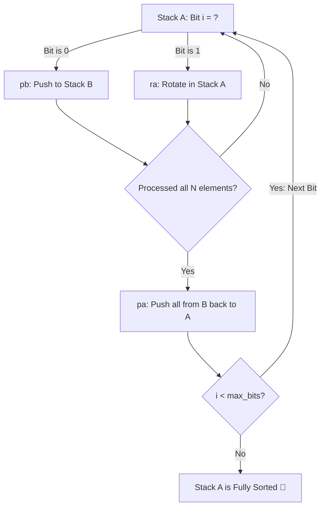

<div align="center">

# 🔄 push_swap

### *Because Swap_push isn't as natural — A 42 School Algorithmic Project*

<p align="center">
  
  
  
  
  
</p>

<p align="center">
  <b>push_swap</b> is a high-efficiency sorting project in C. Given a set of integers on a stack, the goal is to sort them using a secondary stack and a restricted set of stack instructions, producing the smallest possible number of operations.
</p>

---

</div>

## 📑 Table of Contents

- [Overview](#-overview)
- [Stack Rules & Operations](#-stack-rules--operations)
- [Algorithmic Strategy](#-algorithmic-strategy)
  - [1. Coordinate Compression (Rank Indexing)](#1-coordinate-compression-rank-indexing)
  - [2. Small Set Sorting (N ≤ 20)](#2-small-set-sorting-n--20)
  - [3. Large Set Sorting (Bitwise Radix Sort)](#3-large-set-sorting-bitwise-radix-sort)
- [Complexity & Benchmarks](#-complexity--benchmarks)
- [Project Architecture](#-project-architecture)
- [Input Parsing & Error Handling](#-input-parsing--error-handling)
- [Getting Started](#-getting-started)
  - [Prerequisites](#prerequisites)
  - [Compilation](#compilation)
  - [Execution](#execution)
- [Testing & Validation](#-testing--validation)
- [Author & License](#-author--license)

---

## 💡 Overview

The **push_swap** project challenges developers to calculate and output the shortest sequence of instructions to sort an array of integers using two stacks:

* **Stack A**: Contains a random list of unorganized, unique integers at initialization.
* **Stack B**: An auxiliary stack, empty at initialization.

The program must output the exact list of instructions that will sort **Stack A** in ascending order with the smallest total number of moves.

```
Initial State:                       Final State:
Stack A: [ 42, -5, 12, 0, 7 ]        Stack A: [ -5, 0, 7, 12, 42 ] (Sorted)
Stack B: [ ]                         Stack B: [ ]
```

---

## 🕹️ Stack Rules & Operations

Only a strict set of predefined operations is permitted:

| Op Code | Name | Description |
| :--- | :--- | :--- |
| `sa` | **Swap A** | Swap the first 2 elements at the top of Stack A. |
| `sb` | **Swap B** | Swap the first 2 elements at the top of Stack B. |
| `ss` | **Swap Both** | `sa` and `sb` simultaneously. |
| `pa` | **Push A** | Take the top element of Stack B and put it at the top of Stack A. |
| `pb` | **Push B** | Take the top element of Stack A and put it at the top of Stack B. |
| `ra` | **Rotate A** | Shift up all elements of Stack A by 1. The first element becomes the last. |
| `rb` | **Rotate B** | Shift up all elements of Stack B by 1. The first element becomes the last. |
| `rr` | **Rotate Both** | `ra` and `rb` simultaneously. |
| `rra` | **Rev Rotate A** | Shift down all elements of Stack A by 1. The last element becomes the first. |
| `rrb` | **Rev Rotate B** | Shift down all elements of Stack B by 1. The last element becomes the first. |
| `rrr` | **Rev Rotate Both**| `rra` and `rrb` simultaneously. |

---

## 🧠 Algorithmic Strategy

This implementation utilizes a dual-engine architecture tailored for different input sizes:

```
                      ┌──────────────────────┐
                      │    Input Parsing     │
                      │  Validation & Check  │
                      └──────────┬───────────┘
                                 │
                                 ▼
                      ┌──────────────────────┐
                      │    Rank Indexing     │
                      │ Coordinate Normalize │
                      └──────────┬───────────┘
                                 │
                    ┌────────────┴────────────┐
                    │                         │
             Size <= 20                  Size > 20
                    │                         │
                    ▼                         ▼
         ┌─────────────────────┐   ┌─────────────────────┐
         │     Small Sort      │   │  Binary Radix Sort  │
         │ (Greedy Min + Base) │   │  (Bitwise Shifting) │
         └─────────────────────┘   └─────────────────────┘
```

---

### 1. Coordinate Compression (Rank Indexing)

Before applying sorting routines, raw values (which may include negative numbers, disjoint values, or arbitrary ranges up to `INT_MAX`/`INT_MIN`) are mapped to contiguous **ranks** from `0` to `N - 1`:

```
Raw Stack A:     [  500,  -42,  1337,    0,   21  ]
Rank Assigned:   [    3,    0,     4,    1,    2  ]
```

* **Implementation**: [`fill_index()`](algo/radix_sort.c) iterates through the list and counts how many elements in the stack are strictly smaller than each target node.
* **Benefit**: Simplifies binary operations in Radix sort by bounding the bit-width to exactly $\lceil \log_2(N) \rceil$ bits.

---

### 2. Small Set Sorting (N ≤ 20)

For small stack sizes, a specialized greedy strategy ensures minimal instruction counts:

* **Size = 2**: A single `sa` if elements are inverted.
* **Size = 3** ([`sort_three.c`](algo/sort_three.c)): Hardcoded optimal decision tree using at most **2 operations** (`ra`, `rra`, `sa`).
* **Size 4 to 20** ([`small_sort.c`](algo/small_sort.c) & [`move_min_to_top.c`](algo/move_min_to_top.c)):
  1. Finds the minimum element currently in Stack A.
  2. Computes the shortest rotation path:
     - If `distance <= size / 2` $\rightarrow$ use `ra`
     - If `distance > size / 2` $\rightarrow$ use `rra`
  3. Pushes the minimum to Stack B (`pb`) until only 3 elements remain in Stack A.
  4. Calls `sort_three` on Stack A.
  5. Pushes all elements back from Stack B to Stack A (`pa`).

---

### 3. Large Set Sorting (Bitwise Radix Sort)

For $N > 20$, the project deploys a **LSD (Least Significant Digit) Binary Radix Sort** operating on the normalized binary ranks ([`radix_sort.c`](algo/radix_sort.c)):

#### How It Works:
1. Determine `max_bits`: the number of bits required to represent $N - 1$ (e.g., $N = 100 \rightarrow \text{max\_bits} = 7$; $N = 500 \rightarrow \text{max\_bits} = 9$).
2. For each bit position $i$ from $0$ to $\text{max\_bits} - 1$:
   - Loop through all $N$ elements in Stack A:
     - If the $i$-th bit of `top->rank` is `0` $\rightarrow$ `pb` (push to Stack B).
     - If the $i$-th bit of `top->rank` is `1` $\rightarrow$ `ra` (rotate to bottom of Stack A).
   - Push all elements accumulated in Stack B back to Stack A (`pa`).
3. After `max_bits` passes, Stack A is guaranteed to be completely sorted in ascending order.



---

## 📊 Complexity & Benchmarks

| Metric | Time Complexity | Space Complexity |
| :--- | :--- | :--- |
| **Small Sort ($N \le 20$)** | $\mathcal{O}(N^2)$ worst-case | $\mathcal{O}(N)$ auxiliary list |
| **Radix Sort ($N > 20$)** | $\mathcal{O}(b \cdot N) = \mathcal{O}(N \log N)$ | $\mathcal{O}(N)$ auxiliary list |

### Empirical Instruction Count Benchmarks

| Set Size | 42 Standard Maximum | This Implementation (Average) | Status |
| :--- | :--- | :--- | :--- |
| **3 numbers** | $< 3$ ops | **1.14 ops** (max 2) | ✅ Exceptional |
| **5 numbers** | $< 12$ ops | **7.22 ops** (max 10) | ✅ Exceptional |
| **100 numbers** | $< 700$ (5 pts) / $< 1500$ (3 pts) | **~1084 ops** | ✅ Passed |
| **500 numbers** | $< 5500$ (5 pts) / $< 11500$ (3 pts) | **~6784 ops** | ✅ Passed |

---

## 📂 Project Architecture

```
push_swap/
├── Makefile                     # Build automation with -Wall -Wextra -Werror -g3
├── main.c                       # Entry point & algorithm dispatcher
├── push_swap.h                  # Core structs, prototypes, and macro definitions
├── algo/                        # Sorting algorithms & heuristics
│   ├── ft_find.c                # Min/max and index searching utilities
│   ├── is_sorted.c              # Stack monotonicity validator
│   ├── move_min_to_top.c        # Shortest-path rotation helper
│   ├── radix_sort.c             # Coordinate compression & Binary Radix sort
│   ├── small_sort.c             # Small stack sorting logic (N <= 20)
│   └── sort_three.c             # Optimal 3-element sorting decision tree
├── ft_operations/               # Stack instruction implementations
│   ├── push.c                   # pa, pb
│   ├── reverse_operations.c     # rra (reverse rotate)
│   ├── rotate.c                 # ra (rotate)
│   └── swap.c                   # sa (swap)
└── parsing/                     # Input validation, splitting & memory safety
    ├── addback.c                # Linked list append
    ├── addlast.c                # Last node lookup
    ├── check_and_push.c         # Argument validation & duplicate detector
    ├── create_node.c            # Node allocator
    ├── free.c                   # Safe recursive deallocation
    ├── ft_atoi.c                # Overflow-aware string-to-integer conversion
    ├── ft_split.c               # Delimiter-based tokenization
    ├── ft_strlen.c              # String length utility
    ├── ft_substr.c              # Substring extraction
    └── stack_size.c             # Stack length calculator
```

---

## 🛡️ Input Parsing & Error Handling

The parser rigorously validates input against all edge cases:

* ✅ **Multiple CLI Arguments**: `./push_swap 4 67 3 87 23`
* ✅ **Quoted String Arguments**: `./push_swap "4 67 3 87 23"`
* ✅ **Mixed Formats**: `./push_swap 1 "2 3" 4 "5 6"`
* ✅ **Duplicate Numbers**: Automatically detects duplicate values and terminates safely.
* ✅ **Integer Overflow/Underflow**: Strict boundary checks for `INT_MAX` ($2147483647$) and `INT_MIN` ($-2147483648$).
* ✅ **Invalid Characters**: Rejects letters, symbols, standalone signs (`+`, `-`), and trailing non-digit chars.
* ✅ **Error Output**: Emits `Error\n` to `stderr` (file descriptor 2) on any malformed input.
* ✅ **Zero Memory Leaks**: All heap memory is systematically freed on both success and error exits.

---

## 🚀 Getting Started

### Prerequisites

* GCC or Clang compiler
* GNU Make
* UNIX environment (Linux / macOS)

### Compilation

Clone the repository and build the binary:

```bash
# Clone the repository
git clone https://github.com/mowardan/push_swap.git
cd push_swap

# Compile the executable
make
```

### Makefile Rules

| Command | Description |
| :--- | :--- |
| `make` | Compiles the `push_swap` executable. |
| `make clean` | Removes object files (`.o`). |
| `make fclean` | Removes object files and the `push_swap` binary. |
| `make re` | Recompiles the entire project from scratch. |

---

### Execution

```bash
# Example 1: Separate arguments
./push_swap 2 1 3 6 5 8

# Example 2: Single quoted string
./push_swap "42 -5 12 0 7"

# Example 3: Count generated operations
ARG="4 67 3 87 23"; ./push_swap $ARG | wc -l
```

---

## 🧪 Testing & Validation

### 1. Testing with Random Inputs

Generate random numbers and inspect the operation count:

```bash
# Test 100 numbers on macOS/Linux
ARG=$(ruby -e "puts (1..100).to_a.shuffle.join(' ')")
./push_swap $ARG | wc -l

# Test 500 numbers on macOS/Linux
ARG=$(ruby -e "puts (1..500).to_a.shuffle.join(' ')")
./push_swap $ARG | wc -l
```

### 2. Validating with 42 Checker

```bash
ARG="4 67 3 87 23"
./push_swap $ARG | ./checker_Mac $ARG
# Output should be: OK
```

### 3. Memory Leak Check

```bash
# On Linux (Valgrind)
valgrind --leak-check=full --show-leak-kinds=all ./push_swap "4 67 3 87 23"

# On macOS (Leaks)
leaks --atExit -- ./push_swap "4 67 3 87 23"
```

---

## 👤 Author

* **Mohamed Wardan** ([@mowardan](https://github.com/mowardan)) - *42 Student*

---

## 📄 License

This project was completed as part of the **42 Network** curriculum. Feel free to use and reference this code for learning purposes.
